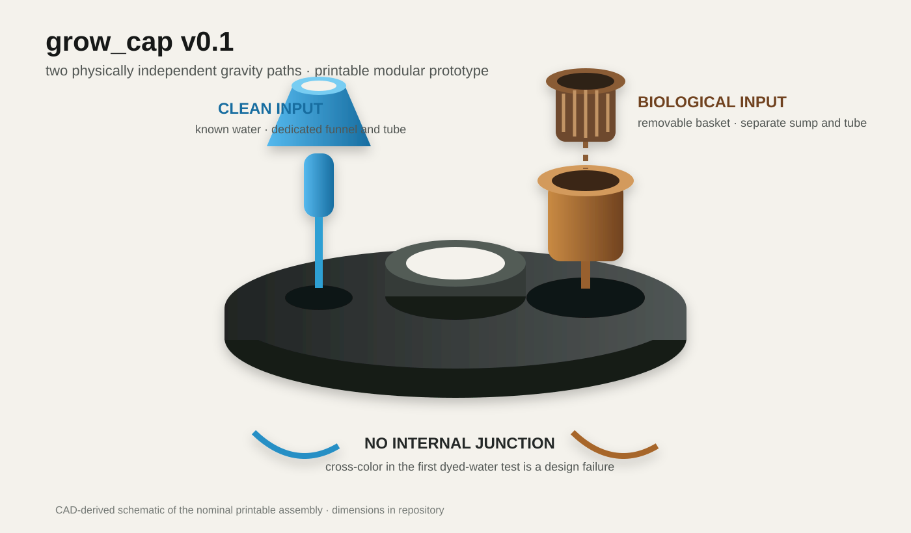

# grow_cap

A generic open-hardware cap for small, gravity-driven nutrient-cycling experiments.

`grow_cap` keeps two water paths physically independent:

- **clean path:** known water enters a dedicated funnel and leaves through its own tube;
- **transformed path:** water passes through a removable mesh-lined biological basket, is collected by a separate sump, and leaves through a second tube.

The paths do not join inside the printed cap. Version 0.1 tests geometry, gravity, leakage, serviceability, and measurement before introducing a valuable plant, compost, worms, sensors, or agent control.

## Print at IdeaSpace

Open [`docs/BAMBU_A1_BUILD.md`](docs/BAMBU_A1_BUILD.md). Print in this order:

1. fit coupon;
2. funnel, sump, basket, and collar;
3. full cap only after checking actual fit.

## Nominal geometry

| Interface | Nominal size |
|---|---:|
| Cap diameter | 140 mm |
| Cap thickness | 5 mm |
| Plant opening | 38 mm |
| Clean funnel spigot | 7 mm OD / 4 mm bore |
| Dirty sump body | 42 mm OD |
| Dirty drain opening | 8.2 mm |
| Biological basket | 34.5 mm OD |
| Split collar stem opening | 14 mm |

The manufacturing meshes are generated from [`cad/generate_grow_cap.py`](cad/generate_grow_cap.py). The first print pack is also available separately for the initial IdeaSpace session.

## Collaboration boundary

This repository does not claim or rename anyone else's project. It is a generic physical-design workspace intended to interoperate with neighboring plant-agent, verification, and coordination experiments when collaborators choose to build together. See [`docs/RELATED_WORK.md`](docs/RELATED_WORK.md).

## Status

**Experimental dimensional prototype.** Not certified for potable water, food contact, pressure, medical use, unattended irrigation, or long-term outdoor deployment.

## License

Hardware source and manufacturing files: CERN-OHL-P-2.0. Documentation and renders: CC BY 4.0.
