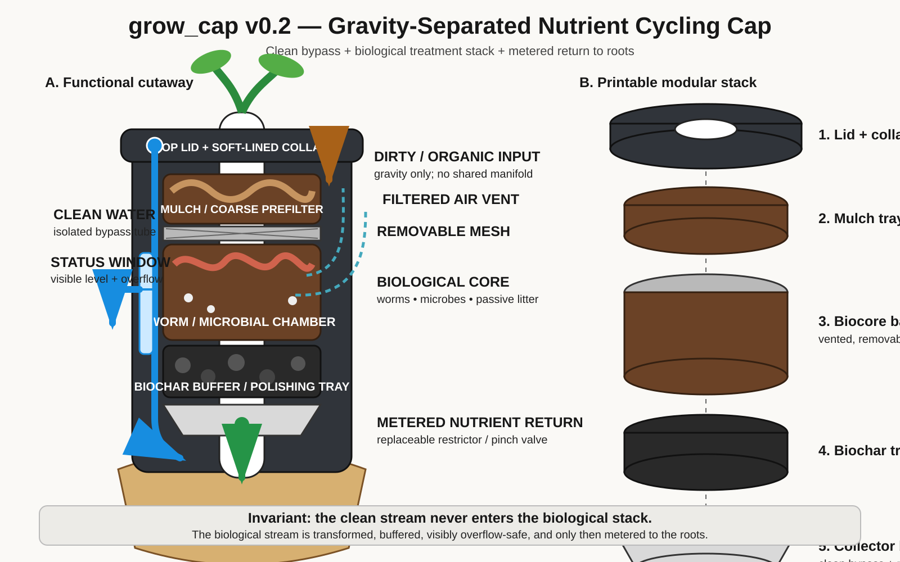

# grow_cap

Open hardware for a gravity-separated plant cap with two physically independent water paths and a removable biological nutrient-processing stack.

## The machine

**Clean water** bypasses the biological processor in a dedicated tube and reaches the root zone unchanged.

**Dirty or organic-bearing water** moves by gravity through:

`mulch prefilter → mesh → worm/microbial chamber → biochar → collector → metered nutrient outlet → roots`

The streams do not share plumbing. A visible overflow must fail outward before the biological stream can contaminate the clean-water interface.

## Repository status

- `v0.1`: dimensional isolation fixture; retained as historical prototype.
- `v0.2`: restored nutrient-cycling architecture based on the original cutaway and design discussion.

Start with:

- [`docs/ARCHITECTURE.md`](docs/ARCHITECTURE.md)
- [`docs/BAMBU_A1_BUILD_V0_2.md`](docs/BAMBU_A1_BUILD_V0_2.md)
- [`cad/grow_cap_v0_2.scad`](cad/grow_cap_v0_2.scad)

## Collaboration boundary

This repository is intentionally generic. It does not claim or absorb AlwaysHungrie's Tumbuh/OmegaClaw work. The projects may develop a gradient of shared interfaces and experiments where collaboration is welcome and mutually agreed.

## Licensing

Hardware source and generated manufacturing files: CERN-OHL-P-2.0. Documentation and renders: CC BY 4.0.
