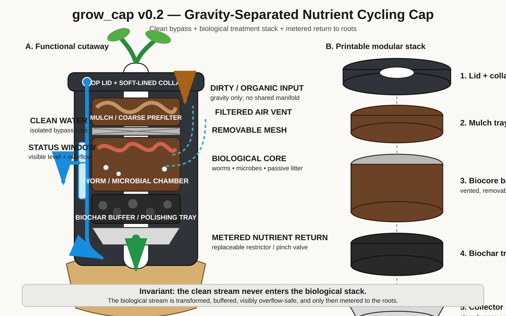

# grow_cap

Open-source hardware for portable, composable, living food production.

GrowCap helps one good plant remain alive and productive across nursery, store, city home, and community growing space. It is a sprouting tray on steroids: instead of maximizing disposable seedlings per tray, it supports sustained production from individual plants such as basil, strawberries, peppers, and compact tomatoes.

## The living machine

The plant ecosystem is the machine. Printed caps, reservoirs, collars, filters, and biological processors are replaceable parts within it.

GrowCap is not a proprietary product, required base, or cartridge system. It is an open construction grammar: shared hydraulic and sanitation principles, compatible interfaces, printable reference designs, and openly learned plant-specific configurations. People should be able to print, fabricate, remix, repair, and compose their own systems.

## Core hydraulic invariant

**Clean water** bypasses the biological processor in a dedicated path and reaches the root zone unchanged.

**Dirty or organic-bearing water** may move by gravity through:

`mulch prefilter → mesh → worm/microbial chamber → biochar → collector → metered nutrient outlet → roots`

The streams do not share plumbing. A visible overflow must fail outward before the biological stream can contaminate the clean-water interface. The streams meet only through the living root zone after the biological stream has been transformed and metered.

The worm/microbial stack is one useful module, not a requirement for every GrowCap implementation.

## Design direction

- **Fully open hardware:** every functional component and interface is reproducible and modifiable.
- **Composable:** systems may be printed in pieces and tiled or adapted to jars, buckets, planters, racks, roofs, and retail displays.
- **Plant-centered:** optimize useful lifetime yield per plant, not seed or substrate throughput.
- **Soil-light or soil-free:** make one established food plant easy to transport, dock, maintain, and take home.
- **Gravity-first:** use passive flow wherever practical while keeping clean and dirty paths physically independent.
- **Locally adaptable:** fit limited light, space, water, materials, and fabrication capacity.
- **Evidence-seeking:** publish experiments and learned bests for each plant rather than embedding guesses in the hardware.

Plant profiles may vary collar geometry, spacing, root volume, medium, flow, nutrient schedule, light support, pruning, and harvest rhythm without requiring a unique biodome for every plant.

## Why

Most produce is harvested, shipped, chilled, displayed, and discarded as it deteriorates. GrowCap explores a different path:

`establish one good plant → keep it alive through distribution → grow where people shop and live → harvest repeatedly`

Do not merely preserve the harvest. Keep the farm alive.

## Repository status

- `v0.1`: dimensional isolation fixture; retained as historical prototype.
- `v0.2`: restored nutrient-cycling architecture based on the original cutaway and design discussion.
- Current direction: expand the hydraulic prototype into an open, composable plant-system specification and experimental library.

Start with:

- [`docs/ARCHITECTURE.md`](docs/ARCHITECTURE.md)
- [`docs/BAMBU_A1_BUILD_V0_2.md`](docs/BAMBU_A1_BUILD_V0_2.md)
- [`cad/grow_cap_v0_2.scad`](cad/grow_cap_v0_2.scad)

## Collaboration boundary

This repository does not claim or absorb AlwaysHungrie's Tumbuh/OmegaClaw work. The projects may develop a gradient of shared interfaces and experiments where collaboration is welcome and mutually agreed.

## Licensing

Hardware source and generated manufacturing files: CERN-OHL-P-2.0. Documentation and renders: CC BY 4.0.
